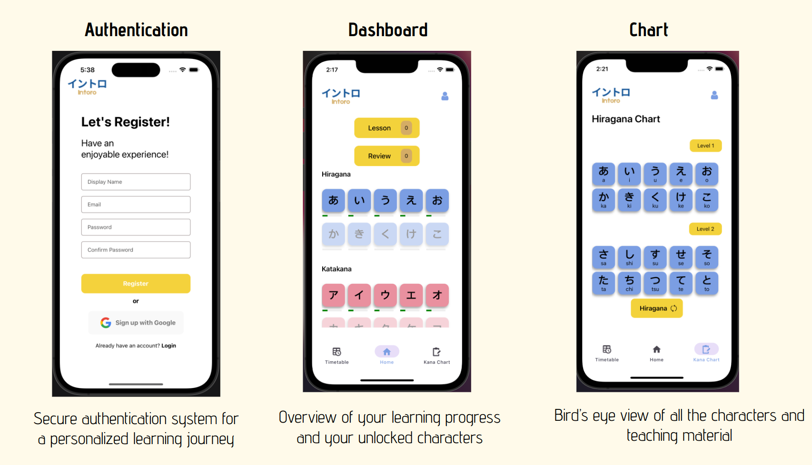

# Intoro 🇯🇵 

 Intoro is an app with researched and effective pedagogy that will help consumers to learn Japanese Kana characters in an entertaining and stress-free manner. 
 
 The purpose of the app is to lay a strong foundation regarding the elementary principles of the Japanese writing system for beginners. The scope of the app is limited to the first two scripts of the language, namely **Hiragana** and **Katakana**. 
 
 It is incorporated with features such as a **spaced repetition system**, **pre-written flashcards**, **timetable** etc to aid the tuition of the users. After using the app consistently for personal study, the user should be familiar with both of the aforementioned scripts and be able to parse through basic Japanese literature.

## Features

<br/>


## Getting Started
---
**NOTE**: It is recommended to use the  `yarn` packet manager for managing dependencies.
1. Install all necessary dependencies:

```
$ yarn 
```
We will use the `yarn` packet manager for managing our dependencies. Please do **NOT** use `npm`.

2. Install all of the necessary dependencies for Firebase functions:
```
$ cd functions && yarn
```

3. You will need to have a ```firebase``` account for interacting with the project. Sign into your firebase account with:
```
$ firebase login
```

4. Connect the project to your firebase account by specifying your project's API key in a `.env` file in the root directory: 
```
FIREBASE_API_KEY=[YOUR FIREBASE PORJECT API KEY]
DEV_OS=[YOUR EMULATOR OS: ANDROID/APPLE]
```

5. It is recommended to install the recommended ```vscode``` extensions for this project. 

6. For local development, use the following command to start an Expo server:
```
$ yarn start
```
**NOTE**: You will have your own copy of Cloud Firestore/Functions/Auth in an emulator for local development. The following command should be run in parallel with your Expo server in another terminal window:
```
$ yarn emulators 
```

7. Use the following command to seed your Firestore emulator:
```
$ yarn seed
```
8. For connecting to your real Firestore database, use the following command:
```
$ yarn start:staging
```

**Note**: Due to the complex nature of the installation process, a docker image of the project will be released soon !!!

## Contributors
- [Akshit Kumar](https://www.linkedin.com/in/akshit-kumar-jain-4444371b5/): Project Lead and Full Stack Engineer
- [John Nicholas Suharjono](https://www.linkedin.com/in/john-nicholas-suharjono/?originalSubdomain=sg): Front-end Engineer
- [Sumair Hasan](https://www.linkedin.com/in/sumair-hasan/?locale=zh_CN): UI/UX Designer
- [Iman Zulhakeem](): UI/UX Designer
- [Syamil Sabirin](https://www.linkedin.com/in/syamil-sabirin-875776233/?originalSubdomain=sg): UI/UX Designer
- [Chua Wen Huat](https://www.linkedin.com/in/chua-wen-huat-757583154/?originalSubdomain=sg): Data Engineer
- [Samyuktha Gurusamy](https://www.linkedin.com/in/samyuktha-gurusamy/): Data Engineer

## Credits
All learning material in this app is was taken from and is owned by [Tofugu](https://www.tofugu.com/).
<br/>
The app is also heavily inspired by the design of [WaniKani](https://www.wanikani.com).
